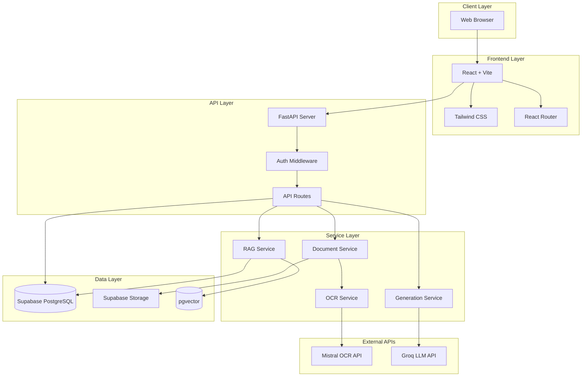
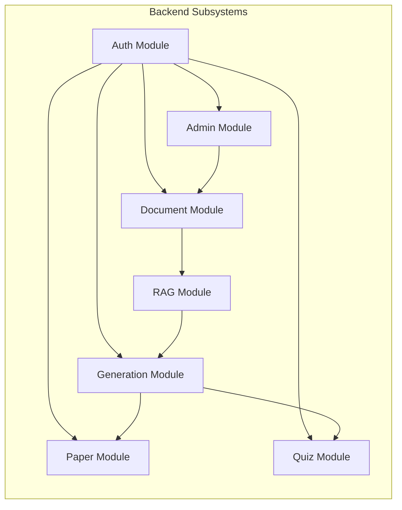
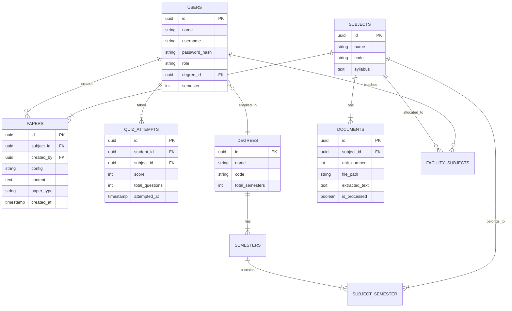
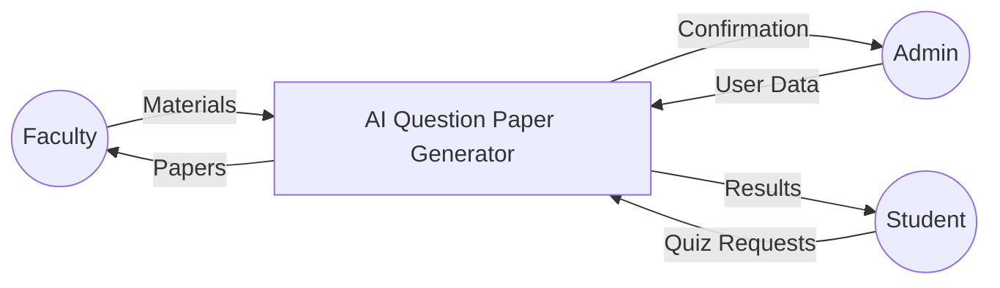
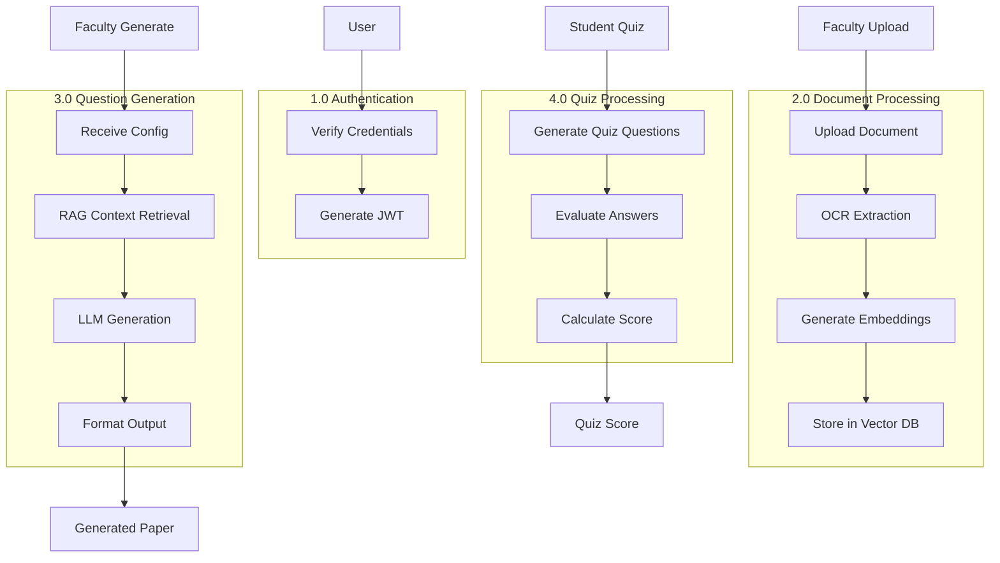
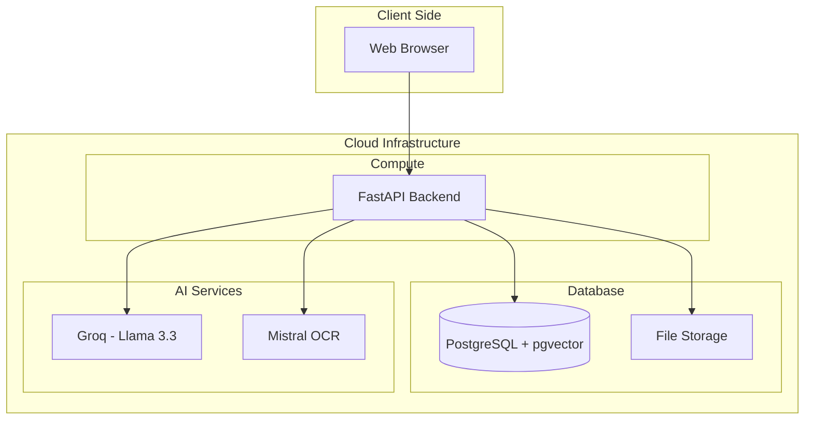
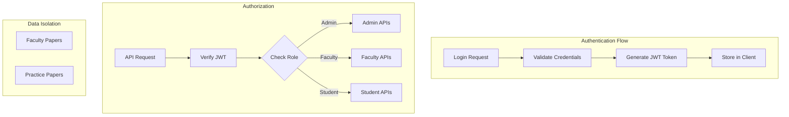

# Review 1: Requirement Analysis Document & System Design Document

## AI-Powered Question Paper Generator

**Team Members**: [Your Names]  
**Guide**: [Guide Name]  
**Course**: CSCI 3091 Project Work  
**Date**: January 2026

---

# PART A: REQUIREMENT ANALYSIS DOCUMENT (RAD)

---

## Slide 1: Title Slide

- **Project Title**: AI-Powered Question Paper Generator
- Team Members: [Your Names]
- Guide: [Guide Name]
- Course: CSCI 3091 Project Work
- Date: January 2026

---

## Slide 2: Introduction – Purpose of the System

- Automates question paper creation for college exams
- Uses AI to generate questions from uploaded study materials
- Reduces manual effort for faculty members
- Provides practice papers and quizzes for students
- Supports multiple question types (MCQ, Short Answer, Long Answer, Fill-in-blanks)

---

## Slide 3: Scope of the System

**Users**: Admin, Faculty, Students

**Core Functions**:
- User authentication & role-based access
- Degree, semester & subject management
- Document upload with OCR support
- AI-based question generation
- Practice papers and quizzes for students

**Out of Scope (V1)**:
- LMS integration
- Mobile application
- Answer key generation
- Bloom's taxonomy tagging

---

## Slide 4: Objectives & Success Criteria

| Objective | Success Criteria |
|-----------|------------------|
| Reduce paper creation time | 80% reduction (< 15 mins vs 2-3 hrs) |
| Question quality | 90% faculty satisfaction |
| Syllabus alignment | 95%+ topic coverage |
| Question variety | Different phrasings per generation |
| Student engagement | 60%+ students use practice papers |

---

## Slide 5: Current System (Problem Statement)

| Problem | Impact |
|---------|--------|
| Manual paper creation | Takes 2-3 hours per paper |
| Quality inconsistency | Questions may lack depth or relevance |
| Repetitive work | Same effort every semester |
| Limited variety | Hard to generate diverse questions |
| No student resources | Students lack practice materials |
| Question bank maintenance | Labor-intensive for faculty |

---

## Slide 6: Proposed System – Overview

- Web-based application accessible from any browser
- **Admin**: Manages degrees, semesters, subjects, and users
- **Faculty**: Uploads materials → Configures paper → Downloads generated paper
- **Students**: Access materials, generate practice papers, take quizzes
- AI-powered generation using RAG (Retrieval-Augmented Generation)
- OCR support for scanned documents

---

## Slide 7: Functional Requirements

| FR# | Category | Requirement |
|-----|----------|-------------|
| FR1 | Auth | User authentication (Admin/Faculty/Student) |
| FR2 | Auth | Role-based dashboard routing |
| FR3 | Admin | Register faculty and students |
| FR5 | Admin | CRUD operations for degree programs |
| FR7 | Admin | Create subjects and assign to degree/semester |
| FR8 | Admin | Allocate subjects to faculty |
| FR11 | Faculty | Select single or multiple units for paper |
| FR12 | Faculty | Upload syllabus and reference materials |
| FR14 | Faculty | OCR for scanned documents |
| FR15 | Faculty | Configure question types and quantities |
| FR16 | Faculty | Select difficulty level (Easy/Medium/Hard) |
| FR25 | Faculty | Export papers in PDF and DOCX |
| FR30 | Student | Generate practice papers |
| FR33 | Student | Take MCQ quizzes |
| FR36 | Student | Review answers after quiz |

---

## Slide 8: Non-Functional Requirements

| Requirement | Description |
|-------------|-------------|
| **Performance** | Paper generated within 2-3 minutes |
| **Usability** | Simple interface for non-technical users |
| **Reliability** | 95%+ valid question generation |
| **Scalability** | Support multiple concurrent users |
| **Security** | Role-based access, JWT authentication |
| **Data Isolation** | Student papers hidden from faculty & vice versa |
| **Availability** | System accessible 24/7 |
| **Accuracy** | Questions aligned with provided syllabus |

---

## Slide 9: Use Case Diagram

```mermaid
flowchart TB
    subgraph Actors
        Admin((Admin))
        Faculty((Faculty))
        Student((Student))
    end

    subgraph AdminUC["Admin Use Cases"]
        A1[Register Faculty]
        A2[Register Student]
        A3[Manage Degrees]
        A4[Manage Semesters]
        A5[Manage Subjects]
        A6[Allocate Subjects to Faculty]
        A7[Update Student Semester]
    end

    subgraph FacultyUC["Faculty Use Cases"]
        F1[Login]
        F2[View Dashboard]
        F3[Upload Syllabus]
        F4[Upload Reference Material]
        F5[Configure Question Paper]
        F6[Generate Question Paper]
        F7[Download Paper]
        F8[View Generated Papers]
    end

    subgraph StudentUC["Student Use Cases"]
        S1[Login]
        S2[View Dashboard]
        S3[View Subject Materials]
        S4[Download Study Materials]
        S5[Generate Practice Paper]
        S6[Take MCQ Quiz]
        S7[Take Fill-in-Blanks Quiz]
        S8[View Quiz Score]
    end

    Admin --> A1
    Admin --> A2
    Admin --> A3
    Admin --> A4
    Admin --> A5
    Admin --> A6
    Admin --> A7
    Faculty --> F1
    Faculty --> F2
    Faculty --> F3
    Faculty --> F4
    Faculty --> F5
    Faculty --> F6
    Faculty --> F7
    Faculty --> F8
    Student --> S1
    Student --> S2
    Student --> S3
    Student --> S4
    Student --> S5
    Student --> S6
    Student --> S7
    Student --> S8
```

---

## Slide 10: User Interface – Key Screens

| Screen | Description |
|--------|-------------|
| Login Page | Username/password with role selection |
| Admin Dashboard | Cards for Degrees, Subjects, Faculty, Students |
| Faculty Dashboard | Subject cards with "Create Paper" button |
| Paper Creation Wizard | Step-by-step: Units → Upload → Config → Generate |
| Student Dashboard | Enrolled subjects, practice papers, quiz history |
| Quiz Interface | Question display, timer, submit button |

*(Add screenshots or wireframes)*

---

# PART B: SYSTEM DESIGN DOCUMENT (SDD)

---

## Slide 11: System Design – Introduction

**Purpose**: Define the architecture for building the system

**Design Goals**:
- Modular, scalable architecture
- Clear separation between frontend & backend
- AI services as pluggable components
- Secure role-based access control
- Maintainable and extensible codebase

---

## Slide 12: Technology Stack

| Layer | Technology | Purpose |
|-------|------------|---------|
| Frontend | React 19 + Vite 7 | Fast, modern UI framework |
| Styling | Tailwind CSS v4 | Utility-first CSS |
| Backend | FastAPI (Python 3.12) | High-performance API server |
| Database | Supabase (PostgreSQL) | Cloud-hosted relational DB |
| Vector Store | pgvector | Embeddings for RAG |
| OCR | Mistral OCR API | Extract text from documents |
| AI Generation | Groq (Llama 3.3 70B) | Question generation |
| Orchestration | LangChain | RAG pipeline management |
| Auth | JWT Tokens | Secure authentication |

---

## Slide 13: System Architecture Diagram

---

## Slide 14: Subsystem Decomposition

| Subsystem | Responsibility |
|-----------|----------------|
| Auth Module | Login, JWT tokens, role verification |
| Admin Module | Degree, semester, subject, user management |
| Document Module | File upload, OCR processing, storage |
| RAG Module | Text chunking, embeddings, vector search |
| Generation Module | AI question generation with context |
| Paper Module | Store, view, download generated papers |
| Quiz Module | Generate quizzes, score, track attempts |

---

## Slide 15: Database Design (ER Diagram)

---

## Slide 16: Data Flow Diagram (Level 0 & Level 1)

### Level 0 - Context Diagram

### Level 1 - Process Breakdown

---

## Slide 17: Hardware/Software Mapping

| Component | Deployment | Specification |
|-----------|------------|---------------|
| Frontend | Client Browser | Any modern browser |
| Backend | Linux Server / Cloud VM | Python 3.12+, 2GB RAM |
| Database | Supabase Cloud | Free tier sufficient |
| File Storage | Supabase Storage | 1GB free storage |
| AI APIs | Groq + Mistral Cloud | Free tier API keys |

---

## Slide 18: Security & Access Control

**Security Measures**:
- JWT-based stateless authentication
- Password hashing with bcrypt
- Role-based access control (RBAC)
- API keys stored in environment variables
- Faculty can only access allocated subjects
- Students restricted to enrolled degree/semester
- Practice papers isolated from exam papers

---

## Slide 19: API Endpoints Overview

| Module | Endpoint | Method | Description |
|--------|----------|--------|-------------|
| Auth | `/api/auth/login` | POST | User login |
| Auth | `/api/auth/me` | GET | Get current user |
| Admin | `/api/admin/register` | POST | Register user |
| Subjects | `/api/subjects` | GET/POST | List/Create subjects |
| Documents | `/api/documents` | POST | Upload document |
| Documents | `/api/documents/{id}/process` | POST | Process with OCR |
| Generation | `/api/generation/questions` | POST | Generate questions |
| Papers | `/api/papers` | GET/POST | List/Create papers |
| Papers | `/api/papers/{id}/download` | GET | Download paper |

---

## Slide 20: Glossary

| Term | Definition |
|------|------------|
| RAG | Retrieval-Augmented Generation - combines search with AI generation |
| OCR | Optical Character Recognition - extracts text from images/PDFs |
| JWT | JSON Web Token - secure authentication token |
| pgvector | PostgreSQL extension for storing vector embeddings |
| LLM | Large Language Model - AI model for text generation |
| Embeddings | Numerical representations of text for similarity search |
| FastAPI | Modern Python web framework for building APIs |
| Supabase | Open-source Firebase alternative with PostgreSQL |

---

## Slide 21: Conclusion & Next Steps

**What We Covered**:
- RAD defines WHAT the system should do
- SDD defines HOW the system will be built

**Current Status**:
- Core backend APIs implemented
- Database schema designed
- Frontend development in progress

**Next Steps (Review 2)**:
- Object Design Document
- Partial Code Execution
- Unit Testing

**Timeline**:
- Review 2: March 2-6, 2026
- Review 3: April 2-7, 2026
- External Review: April 10-15, 2026

---

## References

1. Object Oriented Software Engineering Using UML, Patterns, Java - Bernd Bruegge, Allen H. Dutoit (2nd Edition)
2. FastAPI Documentation - https://fastapi.tiangolo.com/
3. React Documentation - https://react.dev/
4. Supabase Documentation - https://supabase.com/docs
5. LangChain Documentation - https://python.langchain.com/
